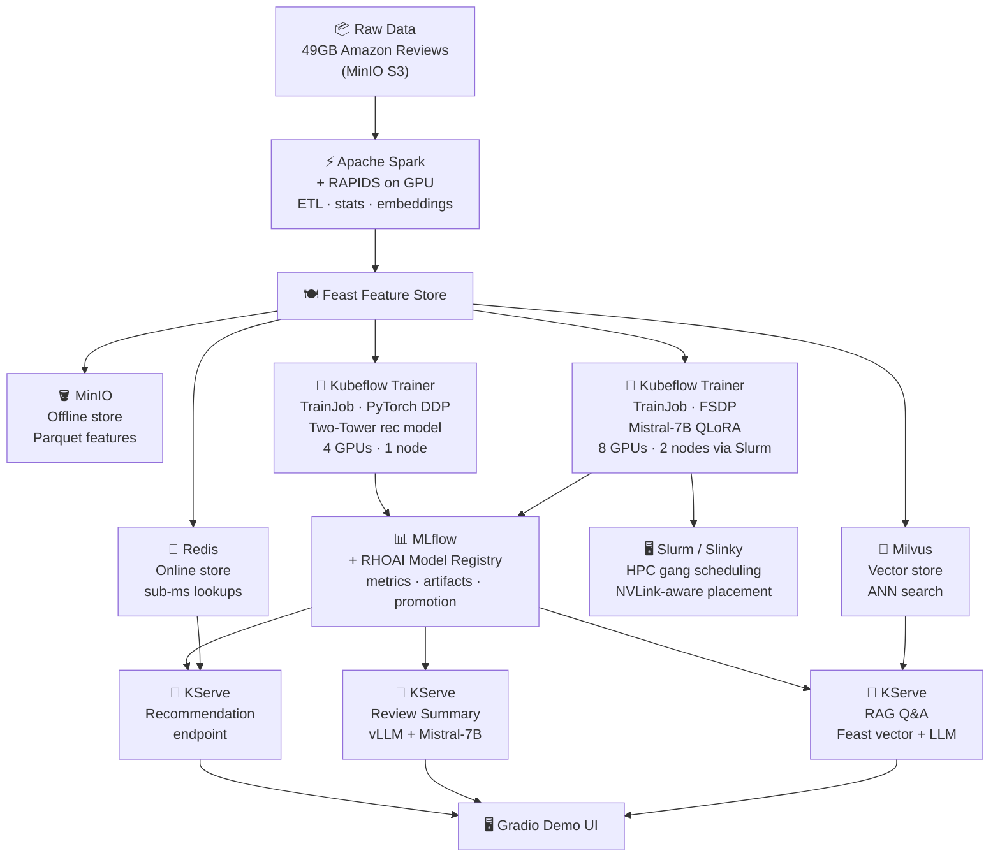

# SmartShop AI — Setup Guide

**Platform:** Red Hat OpenShift AI (RHOAI) 3.4+  
**Cluster:** `apps.oai-kft-ibm.ibm.rh-ods.com` · **Namespace:** `smartshop`

> This is the complete operator reference for deploying the SmartShop AI demo from scratch.
> If you are presenting the demo (not deploying it), see [DEMO-SCRIPT.md](DEMO-SCRIPT.md) instead.

---

## What This Demo Does

SmartShop AI is a production e-commerce ML platform with three end-user features, all served live from a single Gradio UI:

1. **Product recommendations** — two-tower PyTorch model trained on 140M purchase interactions; features fetched from Redis in < 1 ms
2. **Review summaries** — Mistral-7B fine-tuned with QLoRA on 104M cleaned reviews; served via vLLM on KServe
3. **Product Q&A** — RAG pipeline that retrieves semantically similar reviews from Milvus and answers via the same LLM endpoint

The full pipeline — from raw S3 data to live endpoints — runs entirely on OpenShift AI using managed operators and standard Kubernetes manifests. There are no custom scripts that bypass the platform.

---

## Pipeline Overview



---

## Component Reference

| Component | Stage | What it does in this demo |
|---|---|---|
| **Apache Spark** | Data processing | Processes 49GB of Amazon Reviews — computes user/product interaction stats, generates TF-IDF and sentence embeddings, outputs Parquet feature files to MinIO |
| **RAPIDS** | Data processing | Optional GPU-accelerated Spark execution — same SparkApplication YAML, 10× faster on A100s by replacing CPU executors with GPU executors |
| **MinIO** | Storage | S3-compatible object store for everything: raw data, Feast offline features (Parquet), trained model artifacts, and Milvus vector segments. Mounted as shared NFS so notebooks can inspect data directly |
| **Feast** | Feature store | Eliminates training/serving skew — the same feature definitions used to build training datasets are used at inference time. Manages three stores: offline (MinIO/Parquet), online (Redis), vector (Milvus) |
| **Redis** | Online feature store | Holds pre-materialized features in memory for sub-millisecond lookups at serving time — user embeddings, recent interactions, product stats fetched per request |
| **Milvus** | Vector store | Stores dense product/review embeddings for ANN similarity search — used during training for negative sampling and at serving time for RAG retrieval |
| **Kubeflow Trainer** | Training orchestration | Submits two `TrainJob` CRs: one for the two-tower recommendation model (PyTorch DDP, 4 GPUs), one for Mistral-7B QLoRA fine-tuning (FSDP, 8 GPUs via Slurm) |
| **Slurm (Slinky)** | HPC GPU scheduling | Handles the FSDP LLM job — gang scheduling (all GPU pods start together), NVLink-aware placement, multi-node coordination. Jobs submitted directly via `sbatch`. Workers default to `replicas=0`; scale up only for the FSDP demo segment to avoid idle GPU consumption |
| **MLflow** | Experiment tracking | Logs loss curves, hyperparameters, and model artifacts per training run. Writes artifacts to `s3://smartshop-models/` — same path referenced by Model Registry and KServe. No double-upload |
| **RHOAI Model Registry** | Model versioning | Registers model versions pointing to the existing MLflow S3 artifact path. Promotes directly to a KServe InferenceService spec — no re-upload |
| **KServe** | Model serving | Three autoscaling endpoints: recommendation (two-tower), review summary (vLLM + Mistral-7B), product Q&A (RAG — Feast vector search + LLM call) |
| **Gradio** | Demo UI | Single-page app that calls all three endpoints — shows a product page with recommendations, a generated review summary, and a live Q&A box |

---

## Shared Storage Layout

All persistent data lives on NFS PVCs (RWX). No VPC block storage is used in this demo.

### `smartshop-shared-storage` — 200Gi NFS RWX

```
smartshop-shared-storage/
│
├── minio-data/                          ← MinIO root (mounted by MinIO pod)
│   ├── smartshop-raw/                   ← 49GB Amazon Reviews JSON (input)
│   ├── smartshop-features/              ← Spark ETL output → Feast offline → training input
│   │   ├── user_features/               │  user_avg_rating, review_count, tenure…
│   │   ├── item_features/               │  item_avg_rating, price, category…
│   │   └── review_embeddings/           └  review_id, embedding[384], embed_text…
│   ├── smartshop-models/                ← single artifact store shared by all three:
│   │   ├── two-tower-rec/               │  MLflow writes → Model Registry promotes →
│   │   └── mistral-7b-qlora/            └  KServe reads storageUri (no copy, no duplication)
│   └── milvus/                          ← Milvus vector index segments + WAL (S3 backend)
```

### `slurm-home` — 50Gi NFS RWX

```
slurm-home/
└── home/shared/
    ├── scripts/
    │   ├── fsdp-train.sh                ← sbatch script: reads features from MinIO,
    │   └── test-job.sh                     writes adapter weights to smartshop-models/
    └── checkpoints/                     ← ephemeral FSDP mid-training checkpoints
                                            (deleted after training completes)
```

### Per-component NFS PVCs (RWO)

| PVC | Size | StorageClass | Used by |
|---|---|---|---|
| `redis-data` | 10Gi | `nfs-csi` | Redis AOF + RDB persistence |
| `milvus` | 50Gi | `nfs-csi` | Milvus local segment buffer (pre-S3 flush) |
| `data-milvus-etcd-0` | 10Gi | `nfs-csi` | etcd: collection metadata, schema, catalog |
| `feast-smartshop-feast-registry` | 1Gi | `nfs-csi` | Feast registry (auto-created by Feast operator) |
| `mlflow-pvc` | 20Gi | `nfs-csi` | MLflow artifact cache |

> **Why NFS for etcd?** etcd warns about `fsync` latency on NFS. For this demo,
> `ETCD_UNSAFE_NO_FSYNC=true` is set in `infrastructure/milvus/values.yaml`.
> Never set this in production.

### MLflow → Model Registry → KServe: zero-copy artifact flow

```
TrainJob (DDP or FSDP)
  └─ MLflow logs artifacts → s3://smartshop-models/<model>/<run-id>/
        │
        ▼  (registers same S3 path, no upload)
RHOAI Model Registry
  └─ promotes version → InferenceService spec
        │
        ▼  (reads storageUri at pod startup)
KServe InferenceService
  └─ storageUri: s3://smartshop-models/<model>/<run-id>/
```

---

## Prerequisites

### Cluster

| Requirement | Minimum | Notes |
|---|---|---|
| Red Hat OpenShift AI | 3.4+ | RHOAI operator must be installed via OperatorHub |
| Spark Operator | RHOAI-managed | Enable via `DataScienceCluster` → `spec.components.datasciencepipelines.managementState: Managed` |
| Kubeflow Trainer v2 | v2.x | `TrainJob` CRD required |
| Slurm / Slinky | Slinky Operator 0.9+ | Needed only for the FSDP LLM fine-tuning segment |
| Feast Operator | RHOAI-managed | Enabled via RHOAI dashboard or DSC |
| KServe | RHOAI-managed | Serverless mode |
| GPU nodes | 1 node × 4 GPUs minimum | NVIDIA A100 recommended; RAPIDS requires GPU executor nodes |
| NFS RWX StorageClass | `nfs-csi` or equivalent | 200Gi shared storage required for MinIO |
| GPU Operator + DCGM | Latest from OperatorHub | Required for Prometheus GPU metrics |

### Local tools

```bash
oc      # OpenShift CLI — oc login before running any make target
helm    # v3+ for Milvus and Slurm helm installs
aws     # AWS CLI configured to point at MinIO (used for bucket operations)
make    # GNU make
jq      # used by apply-all.sh for DSC condition checks
python3 # with pyarrow (pip install pyarrow) for the Feast schema step
```

### Clone the repo

```bash
git clone https://github.com/abhijeet-dhumal/prod-ml-demo.git
cd prod-ml-demo
```

---

## 0. First-time setup — credentials

**Do this before any other step.** All Kubernetes secrets in this repo are created from a single `.env` file. The manifests contain `${VAR}` substitution markers — never plain `oc apply` a manifest with credentials directly.

```bash
# 1. Copy the template
cp .env.example .env

# 2. Fill in your values — open .env and set:
#    MINIO_ACCESS_KEY, MINIO_SECRET_KEY
#    REDIS_PASSWORD
#    PG_USER, PG_PASSWORD, PG_DATABASE
#    PG_CLUSTERIP  (get after postgres is deployed: oc get svc postgres -n smartshop -o jsonpath='{.spec.clusterIP}')
#    HF_TOKEN      (from https://huggingface.co/settings/tokens — read scope is enough)
#    MINIO_ENDPOINT_EXTERNAL  (after MinIO route is created)

# 3. Create all Kubernetes secrets at once
make setup-secrets
```

`make setup-secrets` creates these secrets across both namespaces:

| Secret | Namespace | Contains |
|---|---|---|
| `smartshop-credentials` | `smartshop` | MinIO + Redis + Milvus endpoints and keys |
| `redis-credentials` | `smartshop` | `REDIS_PASSWORD` |
| `postgres-credentials` | `smartshop` | `PG_USER`, `PG_PASSWORD`, `PG_DATABASE` |
| `feast-s3-credentials` | `smartshop` | MinIO keys for Feast offline store |
| `feast-redis-secret` | `smartshop` | Redis password for Feast online store |
| `minio-root-user` | `smartshop` | MinIO root credentials |
| `hf-credentials` | `smartshop` | HuggingFace token (key: `token`) |
| `mlflow-s3-credentials` | `redhat-ods-applications` | MinIO keys for MLflow artifact store |
| `mlflow-postgres-secret` | `redhat-ods-applications` | PostgreSQL URI for MLflow backend |

> **Re-run `make setup-secrets` any time you rotate credentials or set up a new cluster.**
> It uses `--dry-run=client -o yaml | oc apply -f -` so it is idempotent.

---

## 1. Verify RHOAI

Go to **Operators → Installed Operators**, switch project to `redhat-ods-operator`, click **Red Hat OpenShift AI**.


Click **Data Science Cluster** tab — confirm `default-dsc` shows **Phase: Ready**.


Click `default-dsc` → scroll to **Conditions** — top-level conditions must all be `True`.


Scroll further to see per-component conditions. `FeastOperatorReady`, `KserveReady`, `MLflowOperatorReady`, `ModelRegistryReady`, and `TrainerReady` must all be `True`.


Or verify via CLI:

```bash
oc get datasciencecluster default-dsc -o jsonpath='{.status.phase}'
# Expected: Ready
```

```bash
oc get datasciencecluster default-dsc -o json \
  | jq '.status.conditions[] | select(.status == "False") | {type, reason}'
```

Any `False` condition other than `SparkOperatorReady`, `LlamaStackOperatorReady`, or `ModelsAsServiceReady` must be resolved before continuing.

---

## 2. Create Namespace

The namespace manifest includes required RHOAI labels:

```bash
oc apply -f infrastructure/smartshop/namespace.yaml
```

This creates the `smartshop` namespace with:
- `app.kubernetes.io/part-of: smartshop-ai`
- `opendatahub.io/dashboard: "true"` — makes it a Data Science Project visible in the RHOAI dashboard

---

## 3. Install Slurm Operator and Deploy Cluster

### 3a — Install the Slinky Operator (OperatorHub)

Go to **Operators → OperatorHub**, search for `slurm`. Select **Slurm Operator** (Community, Red Hat HPC Community).


Click the tile to open the detail panel — confirm version `1.0.1-1`, channel `release-1.0`.


Click **Install**. Leave all defaults (installs into `slinky` namespace, cluster-wide scope). Click **Install** to confirm.


Wait ~1 min until status shows **Succeeded**.


**Verify:**

```bash
oc get pods -n slinky
# slurm-operator-xxxxx         1/1   Running
# slurm-operator-webhook-xxxxx 1/1   Running
```

### 3b — Deploy the Slurm Cluster (Helm)

The operator watches for Slurm CRs. The Helm chart creates them.

```bash
# Namespace with privileged SCC (required by Slurm daemons)
oc adm new-project slurm
oc adm policy add-scc-to-user privileged -n slurm -z default

# Shared home PVC (NFS RWX — accessible from login + all worker pods)
oc apply -f infrastructure/slurm/slurm-home-pvc.yaml

# Deploy Slurm cluster
helm install slurm oci://ghcr.io/slinkyproject/charts/slurm \
  --namespace slurm \
  --version 1.0.1 \
  -f infrastructure/slurm/values.yaml \
  --set-literal "loginsets.slinky.rootSshAuthorizedKeys=$(cat ~/.ssh/id_ed25519.pub)"
```

> **Image version:** `values.yaml` pins to `25.11.1-centos9-ohpc`. Do not change this — earlier builds lack the HTTP health server the operator's liveness probe requires.

**Verify (~3 min for images to pull):**

```bash
oc get pods -n slurm
# slurm-controller-0          3/3   Running
# slurm-login-slinky-xxx      1/1   Running
# slurm-restapi-xxx           1/1   Running
# slurm-worker-slinky-0       2/2   Running
# slurm-worker-slinky-1       2/2   Running

oc exec -n slurm slurm-controller-0 -c slurmctld -- sinfo
# PARTITION  AVAIL  TIMELIMIT  NODES  STATE  NODELIST
# slinky        up   infinite      2   idle  slinky-[0-1]
# all*          up   infinite      2   idle  slinky-[0-1]
```

All four CRs (`Controller`, `NodeSet`, `LoginSet`, `RestApi`) visible in **Installed Operators → Slurm Operator → All Instances**:


---

## 4. Enable Spark Operator

> **Do not install from OperatorHub/Software Catalog.** The catalog shows several community Spark tiles from `opdev` — avoid them:
> - **Spark Helm Operator** — uses `gcr.io/kubebuilder/kube-rbac-proxy:v0.13.1` which no longer exists; install fails with `ImagePullBackOff`
> - **Spark Application (Operator Backed)** — just a CR template, not an operator
>
> 
>
> Selecting the community Helm Operator shows a "Community Operator" warning badge — and it will fail immediately if you proceed:
>
> 
>
> 
>
> RHOAI 3.4 includes a managed Spark Operator. Enable it via the DataScienceCluster — it's lifecycle-managed and integrates with the DSC health dashboard.

**Via OpenShift Web Console:**

1. Go to **Operators → Installed Operators → Red Hat OpenShift AI**
2. Click **Data Science Cluster → default-dsc → YAML**
3. Find `spec.components.spark.managementState` and set it to `Managed`
4. Click **Save**


**Verify (~2 min):**

```bash
oc get datasciencecluster default-dsc \
  -o jsonpath='{.status.conditions[?(@.type=="SparkOperatorReady")].status}'
# Expected: True

oc get pods -n redhat-ods-applications | grep spark
# spark-operator-controller-xxxxx   1/1   Running
# spark-operator-webhook-xxxxx      1/1   Running
```

**Grant Spark RBAC for the `smartshop` namespace:**

```bash
oc apply -f infrastructure/smartshop/spark-rbac.yaml
```

---

## 5. Deploy MinIO

```bash
oc apply -n smartshop -f - << 'EOF'
---
apiVersion: v1
kind: ServiceAccount
metadata:
  name: demo-setup
---
apiVersion: rbac.authorization.k8s.io/v1
kind: RoleBinding
metadata:
  name: demo-setup-edit
roleRef:
  apiGroup: rbac.authorization.k8s.io
  kind: ClusterRole
  name: edit
subjects:
  - kind: ServiceAccount
    name: demo-setup
---
apiVersion: batch/v1
kind: Job
metadata:
  name: create-s3-storage
spec:
  selector: {}
  template:
    spec:
      containers:
        - args:
            - -ec
            - |-
              oc apply -f https://github.com/rh-aiservices-bu/fraud-detection/raw/main/setup/setup-s3-no-sa.yaml
          command: [/bin/bash]
          image: image-registry.openshift-image-registry.svc:5000/openshift/tools:latest
          name: create-s3-storage
      restartPolicy: Never
      serviceAccountName: demo-setup
EOF
```

Wait for jobs to complete:

```bash
oc get jobs -n smartshop -w
# create-s3-storage        1/1   Complete
# create-minio-root-user   1/1   Complete
# create-minio-buckets     1/1   Complete
```

**Switch to shared NFS storage and set simple credentials:**

```bash
# Scale down
oc scale deployment minio -n smartshop --replicas=0

# Apply the NFS PVC
oc apply -f infrastructure/smartshop/shared-storage.yaml

# Point MinIO at the new PVC
oc patch deployment minio -n smartshop --type=json -p='[
  {"op": "replace", "path": "/spec/template/spec/volumes/0/persistentVolumeClaim/claimName",
   "value": "smartshop-shared-storage"}
]'

# Create minio-root-user secret from .env values
source .env
oc create secret generic minio-root-user \
  --from-literal=MINIO_ROOT_USER="$MINIO_ACCESS_KEY" \
  --from-literal=MINIO_ROOT_PASSWORD="$MINIO_SECRET_KEY" \
  -n smartshop --dry-run=client -o yaml | oc apply -f -

# Scale back up
oc scale deployment minio -n smartshop --replicas=1
oc rollout status deployment/minio -n smartshop

# Delete the old block PVC
oc delete pvc minio -n smartshop
```

**Create SmartShop buckets:**

```bash
source .env
export S3=https://$(oc get route minio-s3 -n smartshop -o jsonpath='{.spec.host}')

for bucket in smartshop-raw smartshop-features smartshop-models smartshop-embeddings milvus; do
  AWS_ACCESS_KEY_ID="$MINIO_ACCESS_KEY" AWS_SECRET_ACCESS_KEY="$MINIO_SECRET_KEY" \
    aws s3 mb s3://$bucket --endpoint-url $S3 --no-verify-ssl
done
```

Update `MINIO_ENDPOINT_EXTERNAL` in `.env` with the MinIO S3 route hostname, then run `make setup-secrets` to create the consolidated `smartshop-credentials` secret:

```bash
# Get the external MinIO S3 URL
oc get route minio-s3 -n smartshop -o jsonpath='{.spec.host}'
# → set MINIO_ENDPOINT_EXTERNAL=https://<that host> in .env

make setup-secrets
```


> **MinIO note:** Open-source MinIO is used here for simplicity. For production use
> **ODF (OpenShift Data Foundation)** or **AIStor** (MinIO's enterprise successor).
> AIStor is available in OperatorHub — search for `minio` in the Software Catalog.
>
> 

---

## 6. Deploy Redis + RedisInsight UI

```bash
# Secrets must exist before the deployment reads them
make setup-secrets

# Deploy Redis + RedisInsight (envsubst fills ${REDIS_PASSWORD} from .env)
envsubst < infrastructure/redis/redis.yaml | oc apply -f -
oc rollout status deployment/redis deployment/redisinsight -n smartshop
```

This creates:
- `redis-data` PVC — 10Gi, `nfs-csi`, RWX
- `redis-credentials` Secret — password from `REDIS_PASSWORD` in `.env`
- Route for RedisInsight UI

**Verify:**

```bash
source .env
oc exec -it deployment/redis -n smartshop -- \
  redis-cli -a "$REDIS_PASSWORD" ping
# PONG
```

---

## 7. Deploy Milvus + Attu UI

The deploy script handles two known OpenShift issues automatically:

**Issue 1 — etcd SCC:** `milvusdb/etcd` runs as UID 1001, outside OpenShift's default allowed range. The script creates a `milvus` ServiceAccount and grants it `anyuid` SCC.

**Issue 2 — env var injection:** Kubernetes auto-injects `MINIO_PORT`, `MINIO_SERVICE_HOST` etc. from the `minio` Service in the same namespace. These override `values.yaml` and cause Milvus to build a malformed S3 URL (`Endpoint url cannot have fully qualified paths`). The script blanks these injected vars explicitly. ([upstream issue](https://github.com/zilliztech/milvus-helm/issues/99))

```bash
cd infrastructure/milvus && ./deploy.sh smartshop
oc apply -f infrastructure/milvus/attu.yaml
oc rollout status deployment/attu -n smartshop
```

**Verify:**

```bash
oc get pods -n smartshop | grep milvus
# milvus-etcd-0                  1/1   Running
# milvus-standalone-xxxxx        1/1   Running

oc logs -n smartshop deployment/milvus-standalone | grep "ready to serve"
# ---Milvus Proxy successfully initialized and ready to serve!---
```

After MinIO, Redis, and Milvus are up, all four core pods should be running in `smartshop`:


---

## 8. Deploy Feast Feature Store

Feast is installed and managed by the RHOAI Feast Operator (enabled by default in the DSC as `FeastOperatorReady`).

### Architecture

SmartShop uses Feast across **three lifecycle stages**:

```
                    SparkApplication (RHOAI Spark Operator)
                    ETL: RAPIDS GPU feature engineering
                              │
                              ▼
                    s3a://smartshop-features/
                    ├── user_features/*.parquet
                    ├── item_features/*.parquet
                    └── interactions/*.parquet
                              │
              ┌───────────────┼───────────────────┐
              ▼               ▼                   ▼
    ┌─────────────────┐  ┌──────────────────┐  ┌─────────────────┐
    │  feast-spark-   │  │  rec-trainer pod │  │  KServe         │
    │  server pod     │  │  (TrainJob)      │  │  InferenceService│
    │                 │  │                  │  │                 │
    │  SparkCompute   │  │  feast.          │  │  feast.         │
    │  Engine         │  │  get_historical  │  │  get_online     │
    │  local[*]       │  │  _features()     │  │  _features()    │
    │  Parquet → Redis│  │  SparkOffline    │  │  Redis → model  │
    └─────────────────┘  │  Store local[*]  │  └─────────────────┘
                         └──────────────────┘
```

| Component | Role |
|-----------|------|
| **SparkComputeEngine** | `feast materialize-incremental` reads SparkSource Parquet → writes to Redis. Runs pyspark `local[*]` **inside** the feast server pod. |
| **SparkOfflineStore** | `feast.get_historical_features()` in training pod. Point-in-time correct join: entity_df × SparkSource Parquet. Runs pyspark `local[*]` inside the rec-trainer pod. |
| **Redis online store** | Sub-ms feature lookup at inference time via `get_online_features()`. |
| **Remote registry** | Training pod reads feature definitions from feast registry server via gRPC (`feast-smartshop-feast-registry:6570`) — no separate registry process needed. |

Both the feast server and rec-trainer use the **same `feast-spark-server` image**: `feature-server:0.62.0 + pyspark==4.0.0 + hadoop-aws JARs`.

### 8a — Build feast-spark-server image

The default RHOAI feature server image (`quay.io/feastdev/feature-server:0.62.0`) ships only `feast[minimal]` (no pyspark). Build the custom image:

```bash
source .env

# Apply ImageStream
envsubst < infrastructure/openshift/imagestreams.yaml | oc apply -f -

# Apply BuildConfig
envsubst < infrastructure/openshift/buildconfigs.yaml | oc apply -f -

# Start build (~5-10 min: pip install pyspark==4.0.0 + 2 JAR downloads ~150MB total)
oc start-build feast-spark-server -n smartshop --follow
```

Verify:
```bash
oc get build -n smartshop | grep feast-spark
# feast-spark-server-1   Docker   Git@<sha>   Complete
```

### 8b — Apply Spark engine ConfigMap + Secret

```bash
source .env
envsubst < infrastructure/openshift/feast-spark-engine.yaml | oc apply -f -
```

- `feast-spark-engine` ConfigMap — batch engine config (`type: spark.engine`, spark_conf with s3a MinIO endpoint)
- `feast-spark-config` Secret — offline store spark_conf injected into `feature_store.yaml`

### 8c — Apply FeatureStore CR

```bash
source .env
envsubst < infrastructure/openshift/feast-operator.yaml | oc apply -f -
```

The CR:
- Sets `spec.batchEngine.configMapRef: feast-spark-engine` — `SparkComputeEngine`
- Sets `offlineStore.persistence.store.type: spark` — `SparkOfflineStore`
- Uses custom `feast-spark-server` image for all containers — includes pyspark + Hadoop-AWS JARs required by SparkOfflineStore
- Overrides all service images to `feast-spark-server:latest`
- Online store: Redis via `feast-redis-secret`
- Registry: file-backed PVC (1Gi `nfs-csi`)

> **NFS double-mount gotcha:** The Feast pod runs registry, offline, and online containers
> in the same pod. NFS CSI cannot mount the same PV twice within a single pod.
> This is why the registry gets its own dedicated 1Gi PVC instead of reusing
> `smartshop-shared-storage`. The offline/online containers use no PVC.

**Watch rollout (~2 min):**

```bash
oc get pods -n smartshop -l feast.dev/name=smartshop-feast -w
# feast-smartshop-feast-xxxxxxxxx-xxxxx   0/4   Pending → 4/4   Running
# (no Init: stages — init containers disabled)
```

**Verify:**

```bash
oc get featurestore -n smartshop
# NAME              STATUS   AGE
# smartshop-feast   Ready    Xm

# Confirm pyspark is available in the pod
oc exec -n smartshop deploy/feast-smartshop-feast -c offline -- python3 -c "import pyspark; print(pyspark.__version__)"
# 4.0.0
```

> ↓ See **§8b** below for the Feature Store dashboard enable step.

> ↓ See **§8c** below for the canonical `feast apply` step.

### 8f — `feast materialize-incremental` (SparkComputeEngine → Redis)

After Phase 3 (Spark ETL) writes real features to MinIO:

```bash
FEAST_POD=$(oc get pod -n smartshop -l feast.dev/name=smartshop-feast \
  -o jsonpath='{.items[0].metadata.name}')

oc exec -n smartshop $FEAST_POD -c offline -- bash -c "
  cd /tmp/smartshop-repo/feast/feature_repo &&
  FEAST_REGISTRY_TYPE=file FEAST_REGISTRY_PATH=/feast-registry/registry.db \
  feast materialize-incremental \$(date -u +'%Y-%m-%dT%H:%M:%S')
"

# What happens internally:
# 1. SparkComputeEngine reads batch_engine config from feature_store.yaml
# 2. SparkSession starts (local[*]) — visible in Spark logs
# 3. spark_session.read.parquet("s3a://smartshop-features/user_features/") via hadoop-aws
# 4. Time-range filter applied (last materialize timestamp → now)
# 5. mapInPandas() writes each row to Redis online store
# 6. Redis DBSIZE increases
```

Verify Redis:
```bash
oc exec -n smartshop deploy/redis -- redis-cli -a ${REDIS_PASSWORD} DBSIZE
# (integer) 12345  ← should be > 0
```

### 8g — Feast Hierarchy and Data Flow

```
Project: smartshop
│
├── Entities (join keys)
│   ├── user_id   STRING  → user_features rows
│   ├── item_id   STRING  → item_features rows
│   └── review_id STRING  → review_embeddings rows
│
├── Data Sources (SparkSource — s3a:// Parquet)
│   ├── s3a://smartshop-features/user_features/       ← RAPIDS Spark ETL output
│   ├── s3a://smartshop-features/item_features/       ← RAPIDS Spark ETL output
│   └── s3a://smartshop-embeddings/review_embeddings/ ← embedding Spark job output
│
├── Feature Views
│   ├── user_features      6 numeric cols  TTL=30d  online=True
│   ├── item_features      6 numeric cols  TTL=30d  online=True
│   └── review_embeddings  384-dim vector  TTL=90d  online=True
│
└── Stores
    ├── Offline  → SparkOfflineStore (MinIO s3a:// Parquet, Spark local[*])
    ├── Online   → Redis (sub-ms serving)
    └── Vector   → Milvus (ANN search for RAG)
```

### 8h — Training Integration (SparkOfflineStore in rec-trainer)

The rec-trainer image includes `feast==0.62.0 + pyspark==4.0.0`. When `FEAST_REPO_PATH` is set in the TrainJob env, `train.py` uses `feast.get_historical_features()` instead of direct `pd.read_parquet`:

```python
# train.py — rank-0 only, result saved to /tmp, all ranks load from /tmp
store = FeatureStore(repo_path=feast_repo_path)
entity_df = interactions[["user_id", "item_id", "event_timestamp"]]
entity_df["event_timestamp"] = pd.to_datetime(entity_df["event_timestamp"], unit="ms", utc=True)
training_df = store.get_historical_features(
    entity_df=entity_df,
    features=["user_features:user_avg_rating", ..., "item_features:item_price"],
).to_df()
```

The training pod connects to the feast **registry server** (not the file PVC) via remote gRPC:
- `FEAST_REGISTRY_TYPE=remote`
- `FEAST_REGISTRY_PATH=feast-smartshop-feast-registry.smartshop.svc.cluster.local:6570`

The training pod's SparkOfflineStore reads Parquet from MinIO directly (same s3a:// paths, same hadoop-aws JARs). It does **not** go through the feast server — only the registry lookup is remote.

**Watch rollout (~2 min):**

```bash
oc get pods -n smartshop -l app=feast-smartshop-feast -w
# feast-smartshop-feast-xxxxxxxxx-xxxxx   0/4   Init:0/1   → 4/4   Running
```

**Verify:**

```bash
oc get featurestore -n smartshop
# NAME              STATUS   AGE
# smartshop-feast   Ready    Xm

oc get featurestore smartshop-feast -n smartshop -o jsonpath='{.status.phase}'
# Ready
```

### 8b — Enable Feature Store in RHOAI Dashboard

The Feature Store tab in the RHOAI dashboard is gated behind a feature flag that defaults to **disabled**. Patch it once per cluster:

```bash
oc patch odhdashboardconfig odh-dashboard-config \
  -n redhat-ods-applications \
  --type=merge \
  -p '{"spec":{"dashboardConfig":{"disableFeatureStore":false}}}'

# Restart dashboard to pick up the config change
oc rollout restart deployment/rhods-dashboard -n redhat-ods-applications
oc rollout status deployment/rhods-dashboard -n redhat-ods-applications
```

The FeatureStore CR also needs the label `feature-store-ui: enabled` — this is already present in `infrastructure/feast/feast-operator.yaml`. Verify:

```bash
oc get featurestore smartshop-feast -n smartshop \
  -o jsonpath='{.metadata.labels.feature-store-ui}'
# enabled
```

After the dashboard restarts, the **Feature Store** section appears in the RHOAI sidebar under the `smartshop` project.

### 8c — Run `feast apply` (register schema)

`feast apply` registers the feature schema and metadata into the Feast registry. It does **not** move any data — it only tells Feast what features exist, where they live, and which entities own them.

```bash
# Run inside the Feast offline container
FEAST_POD=$(oc get pod -n smartshop -l feast.dev/name=smartshop-feast \
  -o jsonpath='{.items[0].metadata.name}')

oc exec -n smartshop $FEAST_POD -c registry -- \
  feast -c /feast-data/smartshop/feature_repo apply

# Expected output:
# Applying changes for project smartshop
# Deploying infrastructure for user_features
# Deploying infrastructure for item_features
# Deploying infrastructure for review_embeddings
```

> **Prerequisite — placeholder Parquet files:** `feast apply` reads the schema
> from the S3 data sources even when `schema=` is explicitly declared (Feast 0.60
> always calls `get_table_column_names_and_types_from_data_source` to populate
> entity columns). Before the Spark ETL has run, the buckets are empty and PyArrow
> returns `ACCESS_DENIED` (MinIO returns HTTP 403 for `HeadObject` on missing keys,
> not 404). Run this once to write empty schema-carrying Parquet files:
>
> ```bash
> oc exec -n smartshop $FEAST_POD -c offline -- python3 << 'EOF'
> import os, pyarrow as pa, pyarrow.parquet as pq, pyarrow.fs as pafs
> from datetime import datetime, timezone
>
> endpoint = os.environ["AWS_ENDPOINT_URL_S3"].replace("http://", "")
> s3 = pafs.S3FileSystem(
>     access_key=os.environ["AWS_ACCESS_KEY_ID"],
>     secret_key=os.environ["AWS_SECRET_ACCESS_KEY"],
>     endpoint_override=endpoint, scheme="http", force_virtual_addressing=False,
> )
> ts = pa.timestamp("us", tz="UTC")
> placeholders = {
>     "smartshop-features/user_features/_placeholder.parquet": pa.schema([
>         pa.field("user_id", pa.string()), pa.field("event_timestamp", ts),
>         pa.field("user_avg_rating", pa.float64()), pa.field("user_review_count", pa.int64()),
>         pa.field("user_unique_items", pa.int64()), pa.field("user_avg_review_length", pa.float64()),
>         pa.field("user_category_count", pa.int64()), pa.field("user_tenure_days", pa.int64()),
>     ]),
>     "smartshop-features/item_features/_placeholder.parquet": pa.schema([
>         pa.field("item_id", pa.string()), pa.field("event_timestamp", ts),
>         pa.field("item_avg_rating", pa.float64()), pa.field("item_rating_stddev", pa.float64()),
>         pa.field("item_review_count", pa.int64()), pa.field("item_total_helpful_votes", pa.int64()),
>         pa.field("item_avg_review_length", pa.float64()), pa.field("item_price", pa.float32()),
>     ]),
>     "smartshop-embeddings/review_embeddings/_placeholder.parquet": pa.schema([
>         pa.field("review_id", pa.string()), pa.field("event_timestamp", ts),
>         pa.field("item_id", pa.string()), pa.field("user_id", pa.string()),
>         pa.field("rating", pa.float64()), pa.field("review_title", pa.string()),
>         pa.field("embed_text", pa.string()), pa.field("embedding", pa.list_(pa.float32())),
>     ]),
> }
> for path, schema in placeholders.items():
>     with s3.open_output_stream(path) as f:
>         pq.write_table(schema.empty_table(), f)
>     print("OK", path)
> EOF
> ```

---

### 8d — Feast Hierarchy and Data Flow

Understanding what `feast apply` sets up vs what requires real data:

```
Project: smartshop
│
├── Entities (join keys — WHO features describe)
│   ├── user_id   STRING  → joins user_features rows to a user
│   ├── item_id   STRING  → joins item_features rows to a product
│   └── review_id STRING  → joins review_embeddings rows to a review
│
├── Data Sources (WHERE offline data lives — MinIO S3 Parquet)
│   ├── s3://smartshop-features/user_features/          ← written by Spark job A
│   ├── s3://smartshop-features/item_features/          ← written by Spark job A
│   └── s3://smartshop-embeddings/review_embeddings/    ← written by Spark job C
│
├── Feature Views (WHAT features + TTL + online flag)
│   ├── user_features      6 numeric cols  TTL=30d  online=True  entity=user_id
│   ├── item_features      6 numeric cols  TTL=30d  online=True  entity=item_id
│   └── review_embeddings  embedding vector + 5 meta  TTL=90d  online=True  entity=review_id
│
└── Stores
    ├── Offline  → MinIO S3 Parquet  (historical retrieval for training)
    ├── Online   → Redis             (sub-ms lookups at serving time)
    └── Vector   → Milvus            (ANN similarity search for RAG)
```

**Feature counts are intentionally constrained:**
- `user_features`: 6 numeric columns exactly matching `training/recommendation/train.py` `user_feat_cols`
- `item_features`: 6 numeric columns exactly matching `item_feat_cols` — string fields (`item_price_bucket`, `category`) are excluded because they cannot be cast to `torch.float32` tensors
- `review_embeddings`: 384-dim `all-MiniLM-L6-v2` embedding + metadata fields for RAG context

### 8e — Full Data Pipeline (what still needs to run)

`feast apply` ✅ only registers schema. Real data flows through these stages:

```
[❌ Step 1]  Download Amazon Reviews 2023 (~49GB)
             make data-full   (or data-sample for 5% subset)
             Upload to s3://smartshop-raw/raw/

[❌ Step 2]  Spark feature engineering  (make spark-run)
             Reads  → smartshop-raw/raw/
             Writes → smartshop-features/user_features/    (user aggregates)
                    → smartshop-features/item_features/    (item aggregates)
                    → smartshop-features/llm_data/         (instruction-tuning JSONL)

[❌ Step 3]  Spark embedding generation  (make spark-embeddings)
             Reads  → smartshop-raw/raw/
             Writes → smartshop-embeddings/review_embeddings/  (384-dim vectors)

[❌ Step 4]  feast materialize  (make feast-materialize)
             Reads Parquet from S3 (offline store)
             Pushes user/item features → Redis  (online store)
             Pushes embeddings         → Milvus (vector store)

[❌ Step 5]  Training reads from S3/Redis → trains model → saves to smartshop-models/

[❌ Step 6]  KServe serving calls Redis + Milvus at inference time
```

**Current MinIO state** (as of `feast apply`):

```
smartshop-raw/                      EMPTY   ← dataset not downloaded yet
smartshop-features/
  user_features/_placeholder.parquet  ← schema carrier only, 0 rows
  item_features/_placeholder.parquet  ← schema carrier only, 0 rows
  llm_data/                           EMPTY
smartshop-embeddings/
  review_embeddings/_placeholder.parquet  ← schema carrier only, 0 rows
smartshop-models/                   EMPTY
```

### 8f — Verify Feature Store in RHOAI Dashboard

The RHOAI Dashboard shows the registered feature views, entities, and lineage graph:

**Feature views list** — 3 views registered, all Online-enabled:


**Lineage graph** — data sources → entities → feature views:


> **Note on `__dummy` entity in lineage:** The lineage graph shows an internal
> Feast `__no_join_key` placeholder rendered as `Entity: __dummy`. This is a
> RHOAI Dashboard UI rendering artifact — `feast entities list` returns only
> the 3 correct entities. No functional impact.

---

## 9. Deploy MLflow (PostgreSQL backend)

MLflow is operator-managed in `redhat-ods-applications`. It requires a PostgreSQL database for its backend store.

### 9a — Deploy PostgreSQL in `smartshop`

```bash
# Secrets use ${VAR} markers — use envsubst
envsubst < infrastructure/mlflow/postgres.yaml | oc apply -f -
oc rollout status deployment/postgres -n smartshop
```

The manifest creates:
- `postgres` Deployment — OpenShift-native `postgresql:15-el9` image, 5Gi NFS PVC (`postgres-data`)
- `postgres` Service on port 5432
- `postgres-credentials` Secret populated from `PG_USER`, `PG_PASSWORD`, `PG_DATABASE` in `.env`

### 9b — Update MLflow Backend Secret

> **OVN-K DNS gotcha:** MLflow's `NetworkPolicy` in `redhat-ods-applications` has
> `policyTypes: [Ingress, Egress]` (operator-managed). DNS lookups for cross-namespace
> CNAME chains fail under OVN-K even though port 53 is listed in the egress rules.
> Use the postgres Service **ClusterIP** directly — TCP connectivity works fine.

After postgres is running, get its ClusterIP and add it to `.env`:

```bash
oc get svc postgres -n smartshop -o jsonpath='{.spec.clusterIP}'
# e.g. 172.30.26.132 — set PG_CLUSTERIP=<this value> in .env
```

Then re-run `make setup-secrets` to create/update `mlflow-postgres-secret` and `mlflow-s3-credentials` in `redhat-ods-applications` with the correct values from `.env`.

### 9c — Patch MLflow CR for S3 artifacts

Patch the MLflow CR to use S3 as artifact destination (see `infrastructure/mlflow/mlflow-cr.yaml`):

```bash
oc patch mlflow mlflow -n redhat-ods-applications --type=merge -p '{
  "spec": {
    "artifactsDestination": "s3://smartshop-models",
    "serveArtifacts": true,
    "envFrom": [{"secretRef": {"name": "mlflow-s3-credentials"}}]
  }
}'
```

### 9d — Verify MLflow is Running

```bash
oc rollout restart deployment/mlflow -n redhat-ods-applications
oc rollout status deployment/mlflow -n redhat-ods-applications

oc get pods -n redhat-ods-applications | grep mlflow
# mlflow-xxxxx   2/2   Running
```

> **Fixed:** MLflow was crash-looping because the backend secret pointed to
> `postgres.feast-trainer-demo.svc.cluster.local` — an old namespace that no longer exists.
> Steps 9a–9d above resolve this.

**MLflow UI:**

```bash
oc get route mlflow -n redhat-ods-applications -o jsonpath='{.spec.host}'
```


---

## 10. Container Images ✅

All images are built via OpenShift `BuildConfig` and pushed directly to `quay.io/abdhumal` using the `quay-push-secret` in the `smartshop` namespace.

| Image | quay.io path | Built from |
|---|---|---|
| `smartshop-spark-jobs` | `quay.io/abdhumal/smartshop-spark-jobs:latest` | `build/Containerfile.spark` — UBI9/Python 3.12, PySpark + Feast |
| `smartshop-spark-jobs-rapids` | `quay.io/abdhumal/smartshop-spark-jobs-rapids:latest` | `build/Containerfile.spark-rapids` — `apache/spark:3.5.3` + RAPIDS 26.02.2 JAR (cuda12) |
| `smartshop-rec-trainer` | `quay.io/abdhumal/smartshop-rec-trainer:latest` | `build/Containerfile.rec-trainer` — UBI9/Python 3.12, PyTorch DDP |
| `smartshop-llm-trainer` | `quay.io/abdhumal/smartshop-llm-trainer:latest` | `build/Containerfile.llm-trainer` — UBI9/Python 3.12, FSDP + QLoRA |
| `smartshop-rec-server` | `quay.io/abdhumal/smartshop-rec-server:latest` | `build/Containerfile.serving` — UBI9/Python 3.12, FastAPI |

**Rebuild any image:**
```bash
# Create push secret once (credentials from ~/.config/containers/auth.json)
make setup-push-secret QUAY_USER=abdhumal QUAY_TOKEN=<token>

# Apply/update BuildConfigs
make setup-builds

# Rebuild all
make build-images

# Rebuild one
make build-spark        # or build-rec / build-llm / build-serving / build-spark-rapids
```

**`.env` image variables** (update these to use quay.io paths so manifests resolve outside the cluster):
```ini
SPARK_JOBS_IMAGE=quay.io/abdhumal/smartshop-spark-jobs:latest
SPARK_RAPIDS_IMAGE=quay.io/abdhumal/smartshop-spark-jobs-rapids:latest
REC_TRAINER_IMAGE=quay.io/abdhumal/smartshop-rec-trainer:latest
LLM_TRAINER_IMAGE=quay.io/abdhumal/smartshop-llm-trainer:latest
REC_SERVER_IMAGE=quay.io/abdhumal/smartshop-rec-server:latest
```

---

## 11. Run Spark ETL (Feature Engineering)

> **Prerequisite:** Data must land in `s3://smartshop-raw/raw/reviews/` and `raw/metadata/` first.
> Images are already built ✅. Run the download Job below — it streams HF → MinIO directly,
> no local disk required.

### 11a — Download data on-cluster (recommended)

Instead of downloading locally and uploading, run a Kubernetes Job that streams from
HuggingFace directly into MinIO. Avoids local disk/bandwidth entirely.

```bash
# Submit the download Job (streams ~1M reviews/category in sample mode, ~500MB total)
/bin/bash -c 'set -a; source .env; set +a; envsubst < infrastructure/openshift/data-download-job.yaml | oc apply -f -'

# Tail logs
oc logs -n smartshop -f job/smartshop-data-download

# Verify data landed
source .env
S3=https://$(oc get route minio-s3 -n smartshop -o jsonpath='{.spec.host}')
AWS_ACCESS_KEY_ID="$MINIO_ACCESS_KEY" AWS_SECRET_ACCESS_KEY="$MINIO_SECRET_KEY" \
  aws s3 ls s3://smartshop-raw/raw/reviews/ --endpoint-url $S3 --no-verify-ssl
```

To run full dataset (49GB) for the Summit recording, patch the Job's env before apply:

```bash
# Full mode — delete sample Job first, patch env, resubmit
oc delete job smartshop-data-download -n smartshop
# Edit DATA_DOWNLOAD_MODE: full in infrastructure/openshift/data-download-job.yaml
/bin/bash -c 'set -a; source .env; set +a; envsubst < infrastructure/openshift/data-download-job.yaml | oc apply -f -'
```

### 11b — RAPIDS GPU vs CPU baseline (A/B comparison for demo)

The driver logs emit structured `[METRIC]` lines for easy comparison. The canonical Summit story:
*"Same Python code, same manifest — swap one image and the RAPIDS plugin handles the rest."*

**Step 1 — CPU baseline:**

```bash
/bin/bash -c 'set -a; source .env; set +a; \
  envsubst < infrastructure/openshift/spark-application-cpu-baseline.yaml | oc apply -f -'

# Wait for completion, then capture metrics
CPU_DRIVER=$(oc get pod -n smartshop -l spark-app-name=smartshop-feature-engineering-cpu-baseline,spark-role=driver -o name)
oc logs -n smartshop $CPU_DRIVER | grep METRIC
# [METRIC] gpu_accelerated=False
# [METRIC] total_elapsed_s=<N> s
# [METRIC] throughput_rows_per_s=<N> rows/s
```

**Step 2 — RAPIDS GPU:**

```bash
/bin/bash -c 'set -a; source .env; set +a; \
  envsubst < infrastructure/openshift/spark-application-rapids.yaml | oc apply -f -'

GPU_DRIVER=$(oc get pod -n smartshop -l spark-app-name=smartshop-feature-engineering-rapids,spark-role=driver -o name)
oc logs -n smartshop $GPU_DRIVER | grep METRIC
# [METRIC] gpu_accelerated=True
# [METRIC] total_elapsed_s=<M> s   ← should be significantly lower
# [METRIC] throughput_rows_per_s=<M> rows/s
```

**GPU utilization (DCGM — already scraped by OCP monitoring):**

```bash
# Query from the OCP Observe → Metrics console, or:
oc exec -n smartshop deploy/prometheus-k8s -- \
  curl -sg 'http://localhost:9090/api/v1/query?query=DCGM_FI_DEV_GPU_UTIL' | \
  python3 -c "import sys,json; [print(m['metric']['gpu'], m['value'][1]) for m in json.load(sys.stdin)['data']['result']]"
```

**Spark UI (shows GPU operators in the DAG):**

```bash
# Port-forward the Spark UI from the running driver pod
oc port-forward -n smartshop $GPU_DRIVER 4040:4040
# Open http://localhost:4040 → SQL/DataFrame tab → look for GpuHashAggregateExec
```

**CPU path (full pipeline — text preprocessing + embeddings):**

```bash
/bin/bash -c 'set -a; source .env; set +a; envsubst < infrastructure/openshift/spark-application.yaml | oc apply -f -'
```

**Monitor any job:**

```bash
oc get sparkapplication -n smartshop
oc logs -n smartshop -f $(oc get pod -n smartshop -l spark-role=driver -o name | head -1)
```

When the job completes, the following MinIO buckets will be populated with Parquet files:
- `s3://smartshop-features/user_features/`
- `s3://smartshop-features/item_features/`
- `s3://smartshop-embeddings/review_embeddings/`

### Materialize features into Redis (online store)

After ETL completes, push features from the offline store (MinIO) into the online store (Redis):

```bash
FEAST_POD=$(oc get pod -n smartshop -l app=feast-smartshop-feast \
  -o jsonpath='{.items[0].metadata.name}')

oc exec -n smartshop $FEAST_POD -c offline -- \
  bash -c "cd /feast-data/smartshop/feast/feature_repo && \
           feast materialize-incremental $(date -u +%Y-%m-%dT%H:%M:%S)"
```

---

## 12. Run PyTorch Training Jobs

> **Prerequisite:** Feast must be materialized (step 11d) before training reads online features.
> All trainer images are already built and pushed to quay.io ✅.

### 12a — Recommendation Model (DDP, 4 GPUs, 1 node)

```bash
# hf-credentials secret is already created by `make setup-secrets` (key: token)
# Verify:
oc get secret hf-credentials -n smartshop -o jsonpath='{.data.token}' | base64 -d

# Apply TrainingRuntime and TrainJob
oc apply -f infrastructure/openshift/trainjobs.yaml

# Watch the DDP job
oc get trainjob smartshop-rec-train -n smartshop -w
```

### 12b — LLM Fine-tuning (FSDP, 8 GPUs, 2 nodes via Slurm)

The FSDP job dispatches to Slurm for NVLink-aware gang scheduling. Before submitting, scale the Slurm workers up from 0:

```bash
# Scale workers up (default is 0 to avoid idle GPU cost)
oc patch nodesets.slinky.slurm.net slinky -n slurm \
  --type=merge -p '{"spec":{"replicas":2}}'

# Wait for nodes to show as idle in Slurm
oc exec -n slurm slurm-controller-0 -c slurmctld -- sinfo
# PARTITION  AVAIL  TIMELIMIT  NODES  STATE  NODELIST
# slinky        up   infinite      2   idle  slinky-[0-1]

# Apply the FSDP TrainJob (reuses the same trainjobs.yaml)
oc apply -f infrastructure/openshift/trainjobs.yaml

# Watch
oc get trainjob smartshop-llm-finetune -n smartshop -w
```

After training, scale workers back down:

```bash
oc patch nodesets.slinky.slurm.net slinky -n slurm \
  --type=merge -p '{"spec":{"replicas":0}}'
```

---

## 13. Deploy Inference Services

> **Prerequisite:** Trained models must be available at `s3://smartshop-models/` (step 12).
> Serving image `quay.io/abdhumal/smartshop-rec-server:latest` is already built ✅.

```bash
oc apply -f infrastructure/openshift/inferenceservices.yaml
oc get inferenceservice -n smartshop -w
# NAME            URL                                                   READY
# smartshop-rec   https://smartshop-rec-smartshop.apps.<cluster>/      True
```

---

## Quick Reference

| Component | Endpoint | Credentials |
|---|---|---|
| MinIO Console | `https://minio-console-smartshop.apps.<cluster>/` | Secret: `minio-root-user` |
| MinIO S3 (internal) | `http://minio.smartshop.svc.cluster.local:9000` | Secret: `smartshop-credentials` |
| MinIO S3 (external) | `https://minio-s3-smartshop.apps.<cluster>/` | Secret: `smartshop-credentials` |
| Redis | `redis.smartshop.svc.cluster.local:6379` | Secret: `redis-credentials` |
| RedisInsight UI | `https://redisinsight-smartshop.apps.<cluster>/` | Add database on first open |
| Milvus gRPC | `milvus.smartshop.svc.cluster.local:19530` | — |
| Milvus REST | `milvus.smartshop.svc.cluster.local:9091` | — |
| Attu (Milvus UI) | `https://attu-smartshop.apps.<cluster>/` | Pre-configured to `milvus:19530` |
| Feast Offline server | `feast-smartshop-feast-offline.smartshop.svc.cluster.local:8815` | — |
| Feast Online server | `feast-smartshop-feast-online.smartshop.svc.cluster.local:6566` | — |
| Feast Registry (REST) | `feast-smartshop-feast-registry.smartshop.svc.cluster.local:6570` | — |
| Feast UI | `https://feast-smartshop-feast-ui-smartshop.apps.<cluster>/` | — |
| MLflow UI | `https://mlflow-redhat-ods-applications.apps.<cluster>/` | — |
| Slurm login (SSH) | `ssh -o ProxyCommand='oc exec -i -n slurm svc/%h -- socat STDIO TCP:localhost:22' root@slurm-login-slinky` | SSH key at `~/.ssh/id_ed25519` |
| Slurm REST API | `http://slurm-restapi.slurm.svc.cluster.local:6820` | JWT token via `scontrol token` |

| Component | PVC | Size | StorageClass |
|---|---|---|---|
| MinIO data | `smartshop-shared-storage` | 200Gi | `nfs-csi` (RWX) |
| Redis AOF | `redis-data` | 10Gi | `nfs-csi` (RWX) |
| Milvus standalone | `milvus` | 50Gi | `nfs-csi` (RWO) |
| Milvus etcd | `data-milvus-etcd-0` | 10Gi | `nfs-csi` (RWO) |
| Feast registry | `feast-smartshop-feast-registry` | 1Gi | `nfs-csi` (RWO) |
| MLflow artifacts | `mlflow-pvc` | 20Gi | `nfs-csi` (RWX) |
| PostgreSQL (MLflow backend) | `postgres-data` | 5Gi | `nfs-csi` (RWO) |
| Slurm home | `slurm-home` | 50Gi | `nfs-csi` (RWX) |
| Slurm statesave | `statesave-slurm-controller-0` | 1Gi | `nfs-csi` (RWO) |

| Bucket | Purpose |
|---|---|
| `smartshop-raw` | Raw Amazon Reviews dataset |
| `smartshop-features` | Feast offline feature store (Parquet) |
| `smartshop-models` | Trained model artifacts |
| `smartshop-embeddings` | Product/user embedding vectors |
| `milvus` | Milvus vector index segments |

---

## Pipeline Dependencies

Each phase depends on the previous. This table shows what each phase produces and what the next phase consumes, so you know exactly when it is safe to proceed.

| Phase | Command | Produces | Required by |
|---|---|---|---|
| 0 — Credentials | `make setup-secrets` | Kubernetes Secrets in `smartshop` + `redhat-ods-applications` | Everything |
| 1 — Infra | `make deploy` | MinIO buckets, Redis, PostgreSQL, Milvus, MLflow, Feast pod | Phases 3–6 |
| 2 — Images | `make build-images` | Container images pushed to `quay.io` | Phases 3–6 |
| 3 — Dataset | `make data-full` | Raw JSON in `s3://smartshop-raw/` | Phase 4 Spark ETL |
| 4 — Spark ETL | `make spark-run` | Parquet features in `s3://smartshop-features/` and `s3://smartshop-embeddings/` | Phase 5 Feast + Training |
| 5 — Feast | `make feast-apply && make feast-materialize` | Features in Redis online store; embeddings in Milvus | Phase 6 Training + Serving |
| 6 — Training | `make train-rec-k8s && make train-llm-slurm` | Model artifacts in `s3://smartshop-models/` + MLflow runs | Phase 7 Serving |
| 7 — Serving | `make serve-k8s` | Three KServe InferenceService endpoints | Phase 8 Demo UI |
| 8 — Demo UI | `make demo` | Live Gradio UI at the cluster route | — |
