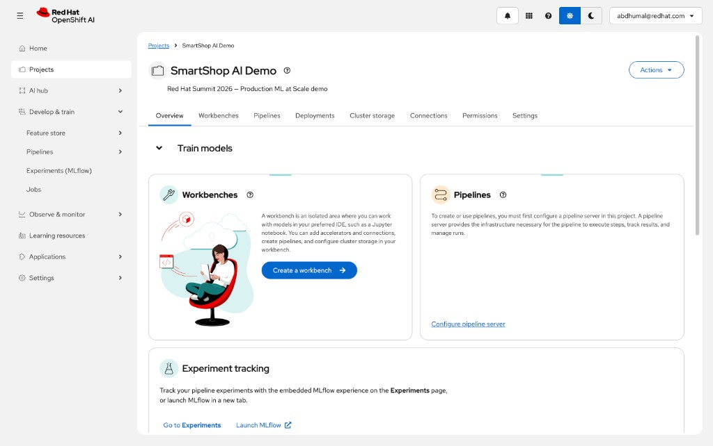
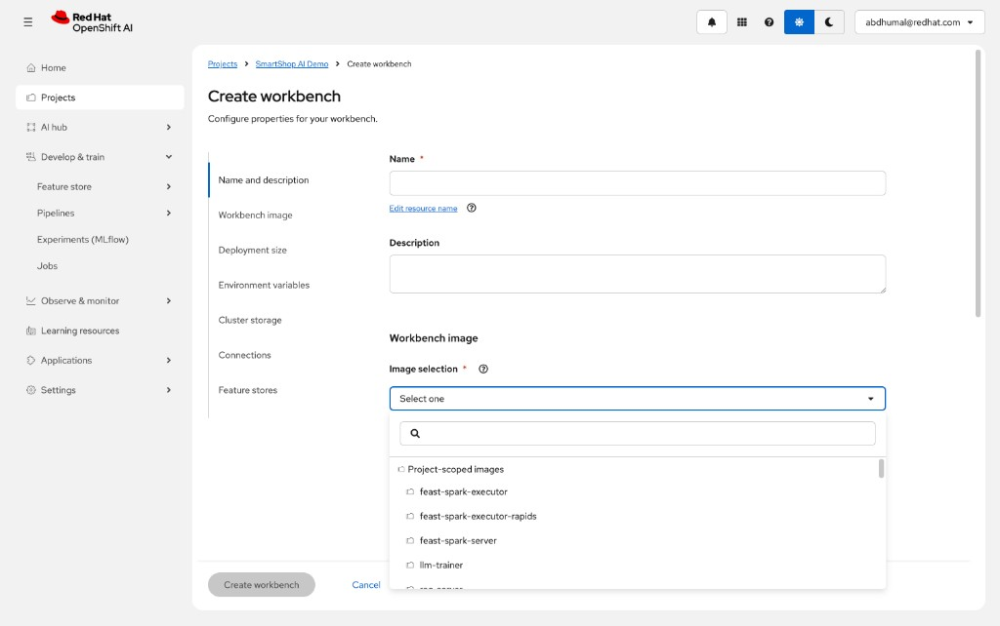
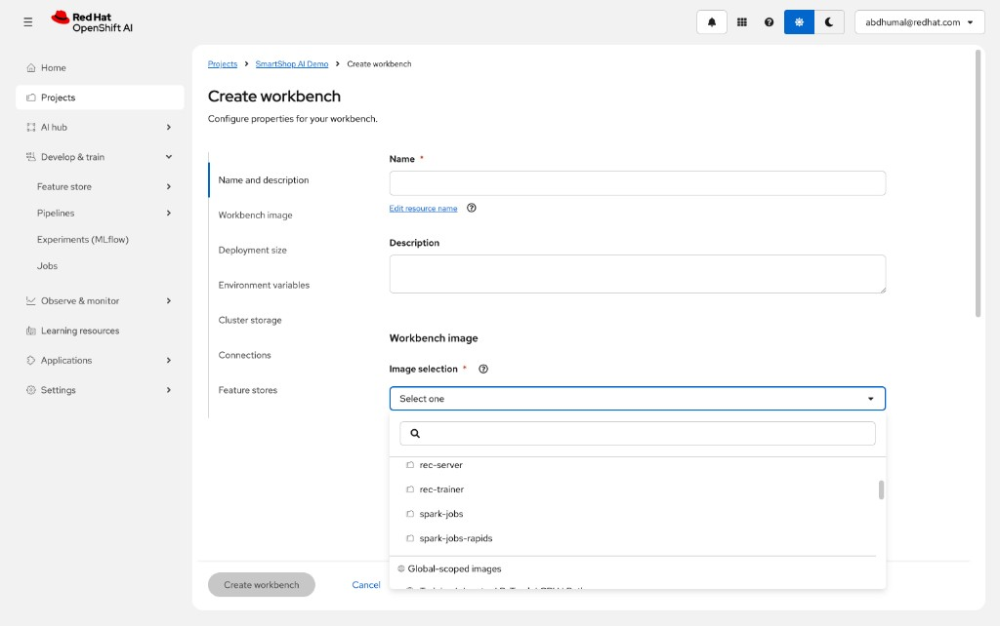
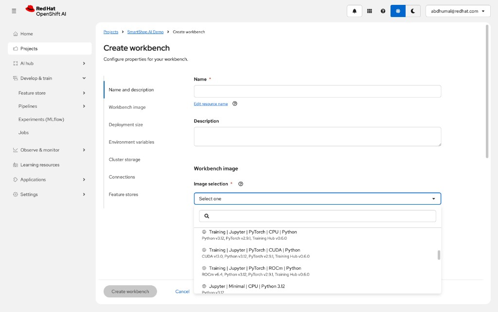
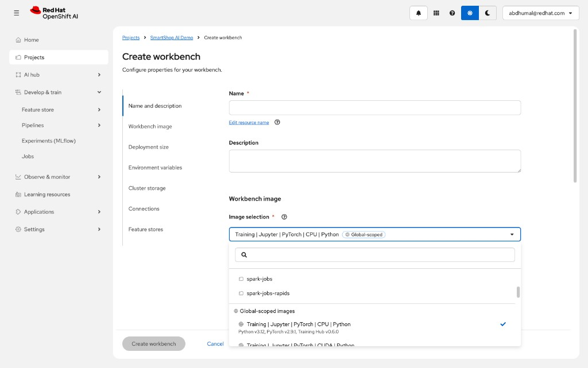
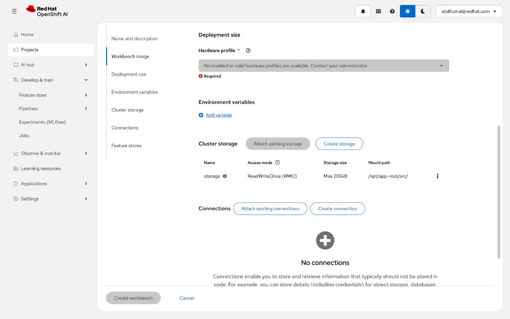
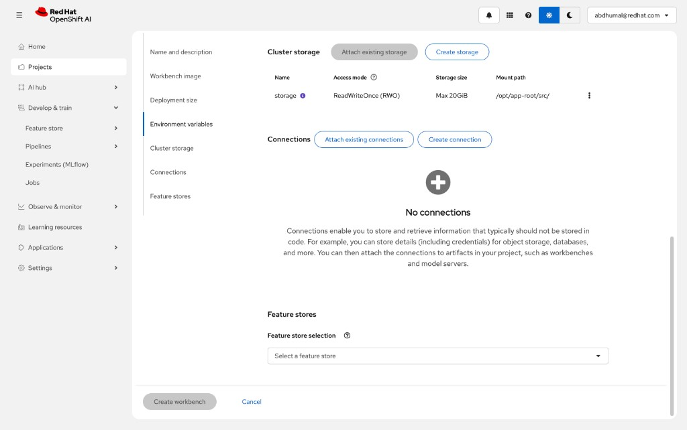
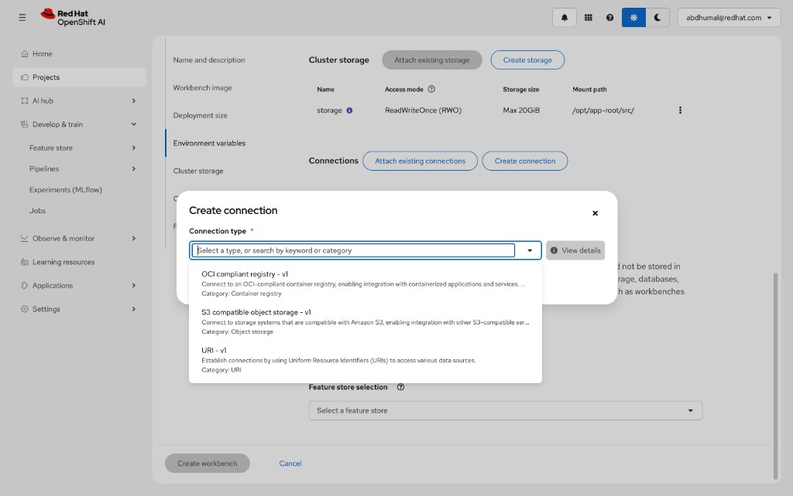
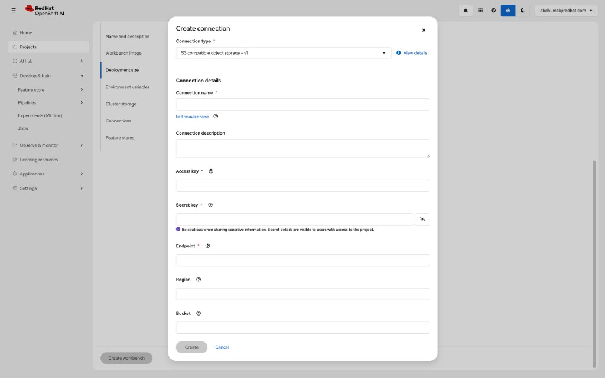
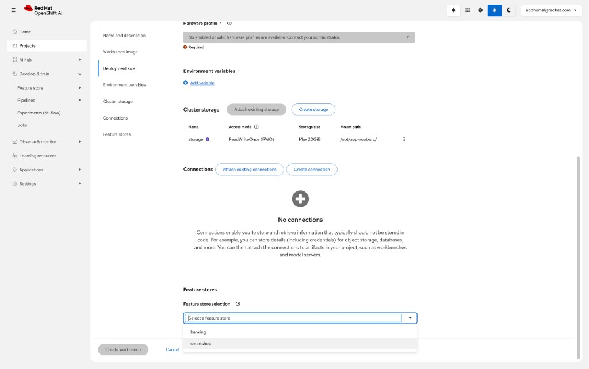

# Creating an RHOAI Workbench — Step-by-Step Guide

> Detailed walkthrough for creating a training workbench on Red Hat OpenShift AI, attaching S3 data connections, and linking the Feast feature store.

---

## Step 1 — Open the SmartShop AI Demo Project

Navigate to **Projects** in the RHOAI Dashboard sidebar and click into the **SmartShop AI Demo** project.

You'll see the project overview page with sections for **Workbenches**, **Pipelines**, and **Experiment tracking** (MLflow).



> **Key sections visible:**
> - **Workbenches** — isolated JupyterLab environments with GPU access
> - **Pipelines** — configure a pipeline server for workflow orchestration
> - **Experiment tracking** — embedded MLflow integration for tracking runs

Click **"Create a workbench"** to begin.

---

## Step 2 — Create Workbench: Name & Image Selection

You land on the **Create workbench** form. The left sidebar shows all configuration sections:

1. Name and description
2. Workbench image
3. Deployment size
4. Environment variables
5. Cluster storage
6. Connections
7. Feature stores

### 2a. Image Selection — Project-Scoped Images

Open the **Image selection** dropdown. The first group is **Project-scoped images** — these are custom images built by BuildConfigs in this namespace:



Project-scoped images available:
- `feast-spark-executor`
- `feast-spark-executor-rapids`
- `feast-spark-server`
- `llm-trainer`

### 2b. Image Selection — More Project-Scoped Images

Scroll down in the dropdown to see the remaining project-scoped images:



Additional project-scoped images:
- `rec-server`
- `rec-trainer`
- `spark-jobs`
- `spark-jobs-rapids`

Below these, the **Global-scoped images** section begins.

### 2c. Image Selection — Global-Scoped Images (RHOAI-Provided)

Scroll further to see the **Global-scoped images** provided by RHOAI out of the box:



Global-scoped images available:
- **Training | Jupyter | PyTorch | CPU | Python** — Python v3.12, PyTorch v2.9.1, Training Hub v0.6.0
- **Training | Jupyter | PyTorch | CUDA | Python** — CUDA v13.0, Python v3.12, PyTorch v2.9.1, Training Hub v0.6.0
- **Training | Jupyter | PyTorch | ROCm | Python** — ROCm v6.4, Python v3.12, PyTorch v2.9.1, Training Hub v0.6.0
- **Jupyter | Minimal | CPU | Python 3.12**

### 2d. Select the PyTorch CPU Image

For training workloads that submit TrainJobs (the workbench itself doesn't need a GPU — the TrainJob workers get their own), select **Training | Jupyter | PyTorch | CPU | Python** from the Global-scoped images:



The dropdown now shows: `Training | Jupyter | PyTorch | CPU | Python` with a **Global-scoped** badge and a blue checkmark.

> **Why CPU for the workbench?** The workbench is used to *submit* TrainJobs via the Kubeflow SDK. The distributed training workers (created by Kubeflow Trainer) get their own GPU allocations. The workbench itself only needs CPU to run notebooks.
>
> If you want to do interactive GPU work (debugging, small experiments), select the **CUDA** variant instead.

---

## Step 3 — Deployment Size, Environment Variables & Storage

Scroll down to configure the remaining workbench settings.



### Hardware Profile

> **Note:** The screenshot shows *"No enabled or valid hardware profiles are available"* — this means the cluster admin needs to create a HardwareProfile or AcceleratorProfile. For a CPU-only workbench, you can proceed without one if the admin creates a default profile.
>
> To check available profiles:
> ```bash
> oc get hardwareprofile -A
> oc get acceleratorprofile -A
> ```

### Environment Variables

Click **"Add variable"** to inject variables the notebooks need:

| Variable | Value | Purpose |
|----------|-------|---------|
| `MLFLOW_TRACKING_URI` | `https://mlflow.redhat-ods-applications.svc.cluster.local:8443` | MLflow experiment logging (RHOAI-managed) |
| `AWS_ACCESS_KEY_ID` | *(from .env)* | MinIO S3 access |
| `AWS_SECRET_ACCESS_KEY` | *(from .env)* | MinIO S3 secret |
| `S3_ENDPOINT_URL` | `http://minio.smartshop.svc.cluster.local:9000` | MinIO endpoint |
| `NAMESPACE` | `smartshop` | Used by Feast config and TrainJob specs |

> **Security:** Use Kubernetes Secrets for `AWS_ACCESS_KEY_ID` and `AWS_SECRET_ACCESS_KEY`. You can reference them as **Secret** type variables instead of pasting raw values.

### Cluster Storage

A default PVC named **storage** is automatically created:

| Name | Access mode | Storage size | Mount path |
|------|------------|-------------|------------|
| `storage` | ReadWriteOnce (RWO) | Max 20GiB | `/opt/app-root/src/` |

This is where your notebooks, code, and any local files are persisted.

---

## Step 4 — Connections (Data Connections)

Scroll down to the **Connections** section. Initially it shows **"No connections"**:



> Connections store credentials for external services (object storage, databases) as Kubernetes Secrets. Attaching a connection to a workbench injects the credentials as environment variables into the notebook pod.

### Also visible: Feature Stores

Below Connections, note the **Feature stores** section with a **Feature store selection** dropdown. This is where you can attach a Feast feature store to the workbench.

---

## Step 5 — Create a Data Connection (S3 / MinIO)

Click **"Create connection"** to open the connection dialog.

### 5a. Select Connection Type

The dialog shows available connection types:



Available types:
- **OCI compliant registry - v1** — Container registry integration
- **S3 compatible object storage - v1** — Amazon S3 / MinIO / any S3-compatible store
- **URI - v1** — Generic URI-based connections

Select **S3 compatible object storage - v1**.

### 5b. Fill in S3 Connection Details

The form expands to show S3-specific fields:



Fill in the following:

| Field | Value | Notes |
|-------|-------|-------|
| **Connection name** | `minio-smartshop` | Descriptive name |
| **Connection description** | `MinIO S3 storage for SmartShop demo` | Optional |
| **Access key** | *(from .env — `AWS_ACCESS_KEY_ID`)* | Your MinIO access key |
| **Secret key** | *(from .env — `AWS_SECRET_ACCESS_KEY`)* | Your MinIO secret key |
| **Endpoint** | `http://minio.smartshop.svc.cluster.local:9000` | Cluster-internal MinIO endpoint |
| **Region** | `us-east-1` | Any value (MinIO ignores this) |
| **Bucket** | `smartshop-models` | Default bucket for model artifacts |

Click **"Create"** to save the connection.

> **What this does behind the scenes:** RHOAI creates a Kubernetes Secret with the S3 credentials and mounts them as environment variables (`AWS_ACCESS_KEY_ID`, `AWS_SECRET_ACCESS_KEY`, `AWS_S3_ENDPOINT`, `AWS_S3_BUCKET`, `AWS_DEFAULT_REGION`) in the workbench pod.

---

## Step 6 — Attach a Feature Store

Scroll to the **Feature stores** section and click the **Feature store selection** dropdown:



Available feature stores:
- `banking`
- `smartshop`

Select **`smartshop`** to attach the Feast feature store to this workbench.

> **What this provides:** The workbench gets access to the Feast registry running in the namespace. Notebooks can call `feast.FeatureStore()` to look up feature schemas, run `get_online_features()` against Redis, and `get_historical_features()` against the S3 offline store — all without manual configuration.

---

## Step 7 — Create the Workbench

Review all settings:

| Setting | Value |
|---------|-------|
| **Name** | `smartshop-training` |
| **Image** | Training \| Jupyter \| PyTorch \| CPU \| Python (Global-scoped) |
| **Hardware profile** | Default (or admin-created profile) |
| **Environment variables** | `MLFLOW_TRACKING_URI`, `NAMESPACE`, S3 creds |
| **Storage** | 20GiB PVC at `/opt/app-root/src/` |
| **Connection** | `minio-smartshop` (S3 compatible) |
| **Feature store** | `smartshop` |

Click **"Create workbench"**.

The workbench will take 1-2 minutes to start (pulling the container image, creating the PVC, injecting secrets). Once the status shows **Running**, click **"Open"** to launch JupyterLab.

---

## What Happens Next

Once JupyterLab opens:

1. **Upload training notebooks** from this repo:
   - `notebooks/01_training_rec.ipynb` — Recommendation model training via Kubeflow SDK
   - `notebooks/02_training_llm.ipynb` — LLM fine-tuning with QLoRA + FSDP
   - `notebooks/03_serving.ipynb` — Serving validation

2. **Run the training notebook** — the key cell uses the Kubeflow SDK:
   ```python
   from kubeflow.training import TrainerClient

   client = TrainerClient()
   client.create_train_job(
       name="smartshop-rec-train",
       trainer=trainer,
       runtime_ref="smartshop-rec-runtime",
   )
   ```

3. **Monitor training** in the RHOAI Dashboard under **Distributed Workloads**, or via:
   ```bash
   oc get trainjob -n smartshop -w
   ```

4. **Check MLflow** for logged metrics, hyperparameters, and model artifacts.

---

## Troubleshooting

### "No enabled or valid hardware profiles are available"

The cluster admin needs to create a HardwareProfile:

```bash
oc get hardwareprofile -A
oc get acceleratorprofile -A
```

If none exist, ask the admin to create one, or deploy the workbench via CLI:

```bash
oc apply -f infrastructure/openshift/e2e-notebook.yaml
```

### Workbench stuck in "Starting"

Check pod events:

```bash
oc get pods -n smartshop -l app=smartshop-training
oc describe pod <pod-name> -n smartshop
```

Common causes: image pull backoff (check ImageStream), PVC binding issues, resource quota exceeded.

### "Migration required" or "Deleted" on existing workbenches

Stale workbenches from older RHOAI versions show this. Delete them and create a fresh one using the steps above.
