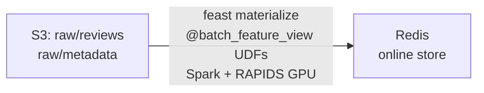
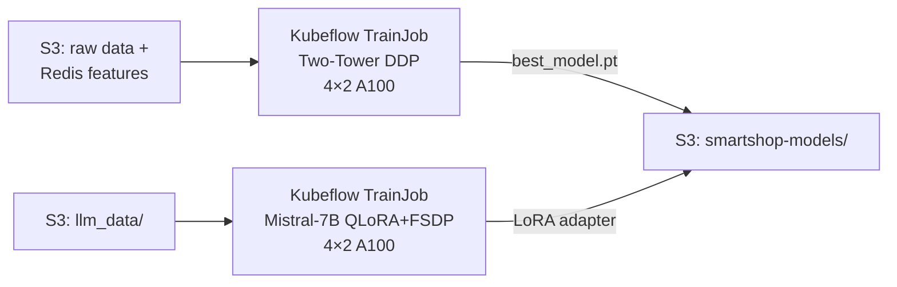
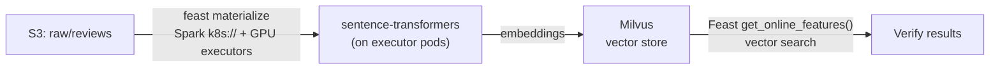
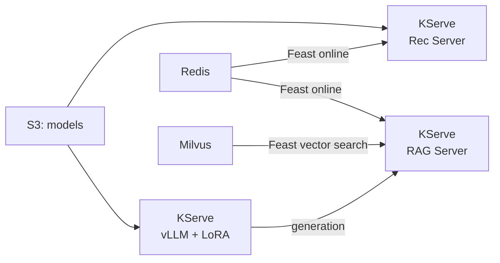
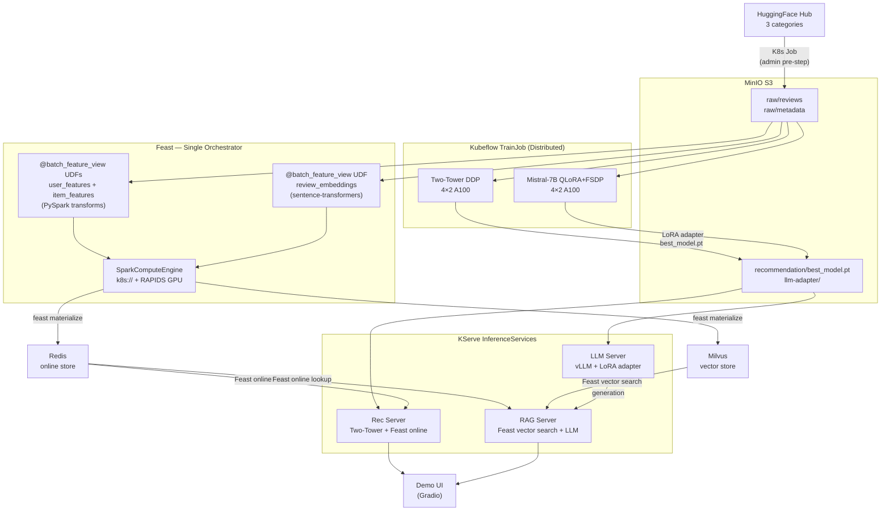

# SmartShop AI — Demo Notebooks

End-to-end ML pipeline on Red Hat OpenShift AI. Run these notebooks in order from an RHOAI workbench to go from raw data to live inference endpoints.

## Prerequisites

- RHOAI workbench in the `smartshop` namespace with FeatureStore connection + S3 DataConnection
- Operators installed: Feast, Spark, Kubeflow Trainer, KServe
- Infrastructure deployed: MinIO, Redis, Milvus, Postgres
- FeatureStore CR, ServingRuntimes, `feast-spark-engine` ConfigMap pre-created by admin
- Environment variables: `AWS_ACCESS_KEY_ID`, `AWS_SECRET_ACCESS_KEY` (via DataConnection)

## Pipeline

| # | Notebook | What it does | Time |
|---|----------|-------------|------|
| 0 | `00_setup.ipynb` | Pre-flight checks: infra connectivity, secrets, Feast config, pod readiness | ~1 min |
| 1 | `01_data_pipeline.ipynb` | `feast materialize` with `@batch_feature_view` UDFs — raw S3 → user/item features in Redis (SparkComputeEngine + RAPIDS) | ~30 min |
| 2 | `02_training.ipynb` | Train Two-Tower rec model (DDP) + fine-tune Mistral-7B (QLoRA/FSDP) via Kubeflow TrainJob | ~2 hr |
| 3 | `03_embeddings.ipynb` | `feast materialize` review embeddings → Milvus via Spark + sentence-transformers on GPU executors | ~45 min |
| 4 | `04_serving.ipynb` | Deploy rec, LLM, RAG InferenceServices via KServe + smoke tests | ~10 min |

Run sequentially — each notebook depends on artifacts from the previous one.

## Directory Layout

```
demo/
├── _config.py                          # Shared config (single source of truth)
├── 00_setup.ipynb                      # Pre-flight checks
├── 01_data_pipeline.ipynb              # Feast @batch_feature_view → Redis (RAPIDS)
├── 02_training.ipynb                   # Rec + LLM distributed training
├── 03_embeddings.ipynb                 # Feast materialize embeddings → Milvus
├── 04_serving.ipynb                    # KServe deploy + smoke tests
│
├── feature_repo/                       # Feast feature definitions
│   ├── features.py                     #   @batch_feature_view: user + item features (→ Redis)
│   ├── features_milvus.py              #   review_embeddings (→ Milvus)
│   ├── feature_store.yaml              #   main config (Spark + Redis)
│   ├── feature_store_milvus.yaml       #   Milvus online store config
│   └── feature_store_serving.yaml      #   serving-time config (no Spark)
│
├── serving/                            # Model server code
│   ├── recommendation/server.py        #   Two-Tower model + Feast item features
│   ├── rag/server.py                   #   RAG: Feast vector search + LLM generation
│   └── llm/server.py                   #   vLLM adapter config
│
└── manifests/                          # OpenShift manifests (admin-managed)
    ├── feast-operator.yaml             #   FeatureStore CR
    ├── feast-spark-engine.yaml         #   Feast batch engine ConfigMap + Spark secret
    ├── feast-spark-engine-rapids.yaml  #   Feast Spark engine (RAPIDS GPU variant)
    ├── serving-runtimes.yaml           #   vLLM + rec ServingRuntimes + InferenceServices
    ├── data-download-job.yaml          #   HuggingFace → S3 download Job template
    ├── trainjobs.yaml                  #   Kubeflow TrainJob definitions
    ├── grafana.yaml                    #   Monitoring dashboard
    └── demo-ui.yaml                    #   Gradio demo UI deployment
```

## Shared Configuration

All notebooks import from `_config.py` — a single source of truth for namespace, endpoints,
secret names, image references, and other shared constants. Change a value once, all notebooks
pick it up. Each notebook adds only its own stage-specific variables on top.

```python
from _config import *   # NAMESPACE, S3_ENDPOINT, REDIS_HOST, MILVUS_HOST, ...
validate()              # initializes K8s config, prints summary, fails fast on issues
```

## Running the Demo

### 1. Open a workbench

Launch an RHOAI workbench (PyTorch image, Large size) in the `smartshop` namespace.
Attach a **FeatureStore** connection (auto-mounts Feast client config) and a
**DataConnection** to MinIO (provides S3 credentials as env vars).

### 2. Pre-flight check (once)

Open `00_setup.ipynb` and run all cells. This verifies:
- Infrastructure connectivity (MinIO, Redis, Milvus, Feast Registry)
- Feast client config is auto-mounted at `/opt/app-root/src/feast-config/smartshop`
- Required K8s secrets exist
- Feast, MinIO, Redis pods are Ready

### 3. Run pipeline notebooks in order

**Notebook 1 — Data Pipeline**
- Prerequisite: raw data already in S3 (data-download Job run by admin)
- Runs `feast apply` + `feast materialize` on the Feast pod's offline container
- Feast `@batch_feature_view` UDFs define PySpark transformations inline
- SparkComputeEngine (RAPIDS GPU) reads raw S3 data, computes features, writes to Redis directly



**Notebook 2 — Training**
- Submits Two-Tower recommendation model training via Kubeflow TrainJob (4 nodes × 2 GPUs, PyTorch DDP)
- Submits Mistral-7B LoRA fine-tuning via Kubeflow TrainJob (4 nodes × 2 GPUs, QLoRA + FSDP)
- Models saved to S3 **before** evaluation to prevent loss on eval failure



**Notebook 3 — Embeddings**
- Sets up a separate Feast repo with Milvus online store config
- Runs `feast apply` to register the `review_embeddings` feature view
- Runs `feast materialize` — Feast's Spark engine reads reviews from S3, runs sentence-transformer inference on GPU executor pods, writes embeddings to Milvus
- Verifies vector similarity search via Feast `get_online_features()`



**Notebook 4 — Serving**
- Deploys `smartshop-rec`, `smartshop-llm`, `smartshop-rag` InferenceServices
- Waits for all three to reach READY state
- Runs smoke tests: recommendation scoring, LLM completion, RAG Q&A with cited sources



### 4. Deploy demo UI

The demo UI requires a separate deployment after all notebooks complete:

```bash
envsubst < manifests/demo-ui.yaml | oc apply -f -
oc rollout status deployment/smartshop-demo-ui -n smartshop
oc get route smartshop-demo-ui -n smartshop -o jsonpath='{.spec.host}'
```

Tabs: Product Recommendations, Review Intelligence, Product Q&A, Observability, Architecture.

## Complete Data Flow


