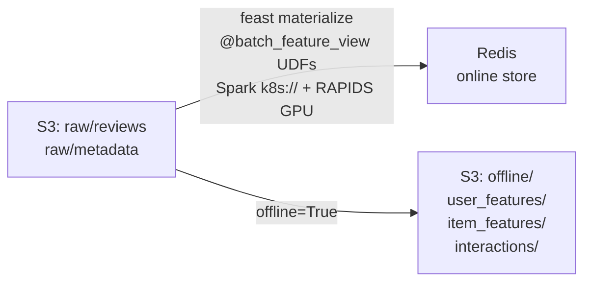
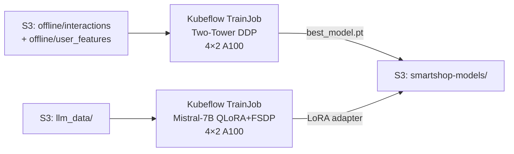
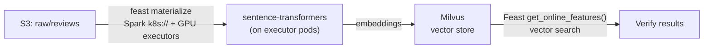
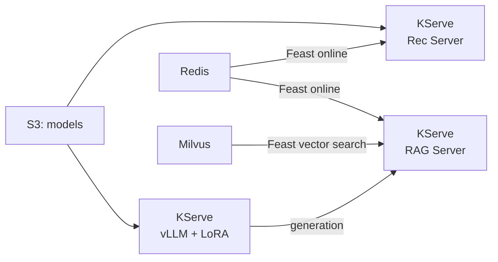
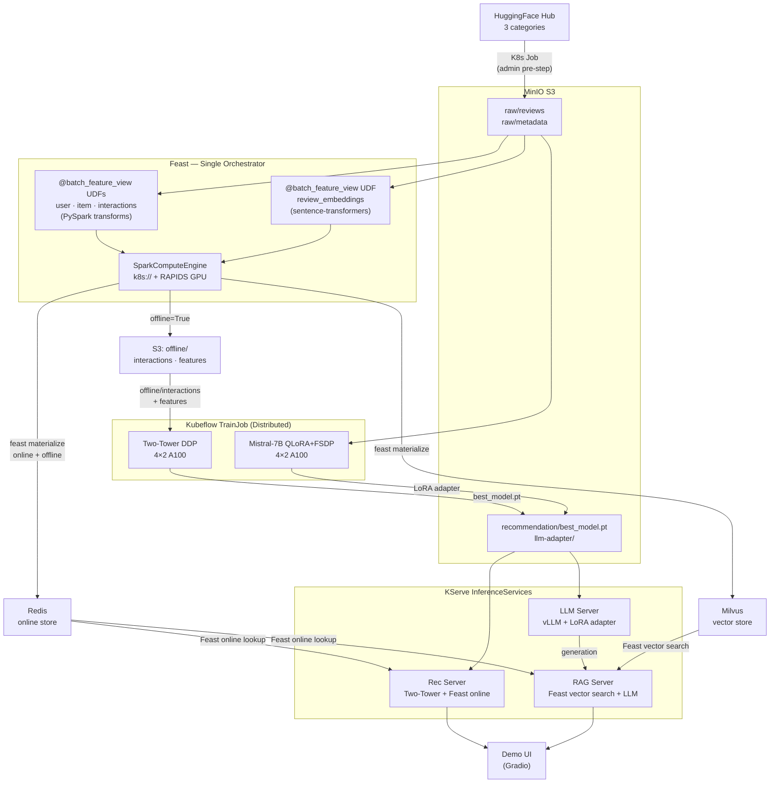

# SmartShop AI — Demo Notebooks

End-to-end ML pipeline on Red Hat OpenShift AI. Run these notebooks in order from an RHOAI workbench to go from raw data to live inference endpoints.

## Prerequisites

- RHOAI workbench in the `smartshop` namespace with FeatureStore connection + S3 DataConnection
- Operators installed: Feast, Spark, Kubeflow Trainer, KServe
- Infrastructure deployed: MinIO, Redis, Milvus, Postgres
- FeatureStore CR, ServingRuntimes, `feast-spark-engine` ConfigMap pre-created by admin
- Environment variables: `AWS_ACCESS_KEY_ID`, `AWS_SECRET_ACCESS_KEY` (via DataConnection)

See [Admin Setup Runbook](#admin-setup-runbook) below for first-time cluster provisioning.

## Pipeline

| # | Notebook | What it does | Time |
|---|----------|-------------|------|
| 0 | `00_setup.ipynb` | Pre-flight checks: infra connectivity, secrets, Feast config, pod readiness | ~1 min |
| 1 | `01_data_pipeline.ipynb` | `feast materialize` with `@batch_feature_view` UDFs — raw S3 → user/item/interaction features in Redis + S3 offline (SparkComputeEngine + RAPIDS) | ~30 min |
| 2 | `02_training.ipynb` | Train Two-Tower rec model (DDP) + fine-tune Mistral-7B (QLoRA/FSDP) via Kubeflow TrainJob | ~2 hr |
| 3 | `03_embeddings.ipynb` | `feast materialize` review embeddings → Milvus via Spark + sentence-transformers on GPU executors | ~45 min |
| 4 | `04_serving.ipynb` | Deploy rec, LLM, RAG InferenceServices via KServe + smoke tests | ~10 min |

Run sequentially — each notebook depends on artifacts from the previous one.

## Directory Layout

```
demo/
├── _config.py                          # Shared config (single source of truth)
├── 00_setup.ipynb                      # Pre-flight checks
├── 01_data_pipeline.ipynb              # Feast @batch_feature_view → Redis (RAPIDS)
├── 02_training.ipynb                   # Rec + LLM distributed training
├── 03_embeddings.ipynb                 # Feast materialize embeddings → Milvus
├── 04_serving.ipynb                    # KServe deploy + smoke tests
│
├── feature_repo/                       # Feast feature definitions
│   ├── features.py                     #   @batch_feature_view: user + item + interactions (→ Redis + S3)
│   ├── features_milvus.py              #   review_embeddings (→ Milvus)
│   ├── feature_store.yaml              #   main config (Spark k8s:// RAPIDS + Redis)
│   ├── feature_store_milvus.yaml       #   Milvus online store config
│   └── feature_store_serving.yaml      #   serving-time config (no Spark)
│
├── serving/                            # Model server code
│   ├── recommendation/server.py        #   Two-Tower model + Feast item features
│   ├── rag/server.py                   #   RAG: Feast vector search + LLM generation
│   └── llm/server.py                   #   vLLM adapter config
│
└── manifests/                          # OpenShift manifests (admin-managed)
    ├── feast-operator.yaml             #   FeatureStore CR
    ├── feast-spark-engine.yaml         #   Feast batch engine ConfigMap (k8s:// RAPIDS) + Spark secret
    ├── feast-spark-driver-svc.yaml     #   Spark driver ClusterIP Service
    ├── serving-runtimes.yaml           #   vLLM + rec ServingRuntimes + InferenceServices
    ├── data-download-job.yaml          #   HuggingFace → S3 download Job template
    ├── trainjobs.yaml                  #   Kubeflow TrainJob definitions
    ├── grafana.yaml                    #   Monitoring dashboard
    └── demo-ui.yaml                    #   Gradio demo UI deployment
```

## Shared Configuration

All notebooks import from `_config.py` — a single source of truth for namespace, endpoints,
secret names, image references, and other shared constants. Change a value once, all notebooks
pick it up. Each notebook adds only its own stage-specific variables on top.

```python
from _config import *   # NAMESPACE, S3_ENDPOINT, REDIS_HOST, MILVUS_HOST, ...
validate()              # initializes K8s config, prints summary, fails fast on issues
```

## Running the Demo

### 1. Open a workbench

Launch an RHOAI workbench (PyTorch image, Large size) in the `smartshop` namespace.
Attach a **FeatureStore** connection (auto-mounts Feast client config) and a
**DataConnection** to MinIO (provides S3 credentials as env vars).

### 2. Pre-flight check (once)

Open `00_setup.ipynb` and run all cells. This verifies:
- Infrastructure connectivity (MinIO, Redis, Milvus, Feast Registry)
- Feast client config is auto-mounted at `/opt/app-root/src/feast-config/smartshop`
- Required K8s secrets exist
- Feast, MinIO, Redis pods are Ready

### 3. Run pipeline notebooks in order

**Notebook 1 — Data Pipeline**
- Prerequisite: raw data already in S3 (data-download Job run by admin)
- Runs `feast apply` + `feast materialize` on the Feast pod's registry container
- Feast `@batch_feature_view` UDFs define PySpark transformations inline
- SparkComputeEngine reads raw S3 data, computes features, writes to Redis + S3 offline parquet
- Feature views: `user_features`, `item_features`, `item_metadata`, `interactions`



**Notebook 2 — Training**
- Submits Two-Tower recommendation model training via Kubeflow TrainJob (4 nodes × 2 GPUs, PyTorch DDP)
- Training reads from Feast-materialized S3 offline parquet (`offline/interactions/`, `offline/user_features/`, `offline/item_features/`)
- Submits Mistral-7B LoRA fine-tuning via Kubeflow TrainJob (4 nodes × 2 GPUs, QLoRA + FSDP)
- Models saved to S3 **before** evaluation to prevent loss on eval failure



**Notebook 3 — Embeddings**
- Sets up a separate Feast repo with Milvus online store config
- Runs `feast apply` to register the `review_embeddings` feature view
- Runs `feast materialize` — Feast's Spark engine reads reviews from S3, runs sentence-transformer inference on GPU executor pods, writes embeddings to Milvus
- Verifies vector similarity search via Feast `get_online_features()`



**Notebook 4 — Serving**
- Deploys `smartshop-rec`, `smartshop-llm`, `smartshop-rag` InferenceServices
- Waits for all three to reach READY state
- Runs smoke tests: recommendation scoring, LLM completion, RAG Q&A with cited sources



### 4. Deploy demo UI

The demo UI requires a separate deployment after all notebooks complete:

```bash
envsubst < manifests/demo-ui.yaml | oc apply -f -
oc rollout status deployment/smartshop-demo-ui -n smartshop
oc get route smartshop-demo-ui -n smartshop -o jsonpath='{.spec.host}'
```

Tabs: Product Recommendations, Review Intelligence, Product Q&A, Observability, Architecture.

## Complete Data Flow



## Environment Variables

Copy `.env.example` to `.env` and fill in credentials. On-cluster, the RHOAI DataConnection injects
`AWS_ACCESS_KEY_ID` and `AWS_SECRET_ACCESS_KEY` automatically. Override image references via
`REGISTRY`, `REC_SERVER_IMAGE`, `RAG_SERVER_IMAGE`, etc. — see `.env.example` for the full list.

## Admin Setup Runbook

One-time cluster provisioning before users can run notebooks. All commands assume `oc login` to the target cluster.

### 1. Create namespace and RBAC

```bash
oc new-project smartshop
```

### 2. Deploy infrastructure

| Component | How | Notes |
|-----------|-----|-------|
| **MinIO** | Helm or OperatorHub | Create buckets: `smartshop-features`, `smartshop-models` |
| **Redis** | `oc apply -f infrastructure/openshift/redis.yaml` | Password in `smartshop-credentials` Secret |
| **Milvus** | Helm (`milvus-standalone`) | Default port 19530 |
| **Postgres** | OperatorHub (Crunchy / CloudNativePG) | For Feast registry |

### 3. Create secrets

```bash
# From .env file
set -a && source .env && set +a

# S3 + Redis credentials
oc create secret generic smartshop-credentials -n smartshop \
  --from-literal=AWS_ACCESS_KEY_ID="$AWS_ACCESS_KEY_ID" \
  --from-literal=AWS_SECRET_ACCESS_KEY="$AWS_SECRET_ACCESS_KEY" \
  --from-literal=AWS_DEFAULT_REGION="${AWS_DEFAULT_REGION:-us-east-1}" \
  --from-literal=REDIS_PASSWORD="$REDIS_PASSWORD" \
  --dry-run=client -o yaml | oc apply -f -

# HuggingFace token (for gated models like Mistral)
oc create secret generic hf-credentials -n smartshop \
  --from-literal=token="$HF_TOKEN" \
  --dry-run=client -o yaml | oc apply -f -

# Service CA ConfigMap (for TLS to Feast registry)
oc apply -f manifests/service-ca-configmap.yaml
```

### 4. Deploy Feast

```bash
# Spark engine ConfigMap (k8s:// RAPIDS GPU mode)
envsubst < manifests/feast-spark-engine.yaml | oc apply -f -

# Spark driver Service (stable host for executor→driver comms)
envsubst < manifests/feast-spark-driver-svc.yaml | oc apply -f -

# FeatureStore CR (Feast Operator deploys offline/online/registry servers)
envsubst < manifests/feast-operator.yaml | oc apply -f -
```

### 5. Download raw data

```bash
envsubst < manifests/data-download-job.yaml | oc apply -f -
oc wait --for=condition=complete job/smartshop-data-download -n smartshop --timeout=30m
```

### 6. Deploy serving infrastructure

```bash
envsubst < manifests/serving-runtimes.yaml | oc apply -f -
```

### 7. Create RHOAI workbench

- Image: **PyTorch** (CUDA), Size: **Large** (8 CPU, 32 Gi)
- Attach **DataConnection** to MinIO (injects `AWS_*` env vars)
- Attach **FeatureStore** connection `smartshop` (auto-mounts Feast client config)
- Install JDK in the workbench (required for NB03 Spark driver — see below)

### 8. JDK installation (workbench)

Notebook 03 (embeddings) runs a Spark driver inside the workbench, which requires a JDK.
Run once in a workbench terminal:

```bash
mkdir -p ~/.local/java && cd ~/.local/java
curl -sL https://download.java.net/java/GA/jdk17.0.2/dfd4a8d0985749f896bed50d7138ee7f/8/GPL/openjdk-17.0.2_linux-x64_bin.tar.gz | tar xz
echo 'export JAVA_HOME=~/.local/java/jdk-17.0.2' >> ~/.bashrc
echo 'export PATH=$JAVA_HOME/bin:$PATH' >> ~/.bashrc
source ~/.bashrc
java -version
```

The `JAVA_HOME` path is already set in NB03's `%%yaml parameters` block.

## Troubleshooting

| Symptom | Fix |
|---------|-----|
| `feast materialize` hangs | Check Spark executors: `oc get pods -l feast-job=materialize -n smartshop` |
| Executor `OOMKilled` (exit 137) | Increase `spark.executor.memoryOverhead` (not heap) — RAPIDS + Python UDFs need overhead. Current: 6g heap + 14g overhead = 20Gi |
| Python `MemoryError` in `_write_partition` | Increase `batch_engine.partitions` (200+). Feast's `list(rows)` loads entire partition into Python memory |
| `ConnectionResetError` from Redis | Reduce concurrent writers: fewer executor cores or increase Redis `maxclients` |
| Executor `ImagePullBackOff` | Verify `spark.kubernetes.container.image` in ConfigMap points to accessible registry |
| `ConnectionRefused` on Feast offline store | Restart Feast pod: `oc delete pod -l feast.dev/name=smartshop-feast -n smartshop` |
| Spark driver port conflict (7078/7079) | Kill orphaned `python3`/`java` processes in Feast pod, force-delete stale executor pods |
| `gRPC resource exhausted` | Don't call `store.materialize()` from notebook — use K8s exec on Feast pod |
| Item features `None` after materialize | Verify `features.py` on Feast pod matches local copy (`oc exec ... cat /feast-data/.../features.py`) |
| `UNSUPPORTED_DATASOURCE_FOR_DIRECT_QUERY` | Ensure `spark.sql.runSQLOnFiles: "true"` is in both `offline_store` and `batch_engine` spark_conf |
| KServe ISVC stuck `Unknown` | Check `oc describe isvc <name>` and `oc get events --sort-by=.lastTimestamp` |
| vLLM OOM on base model | Reduce `--max-model-len` or increase GPU memory in ServingRuntime |
